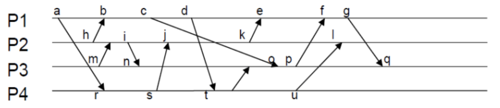
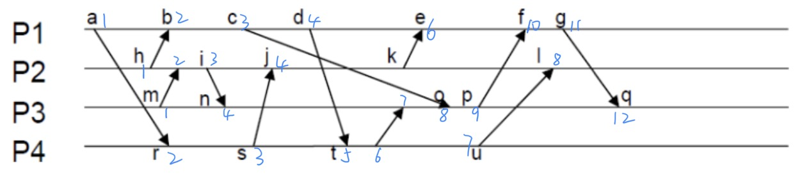
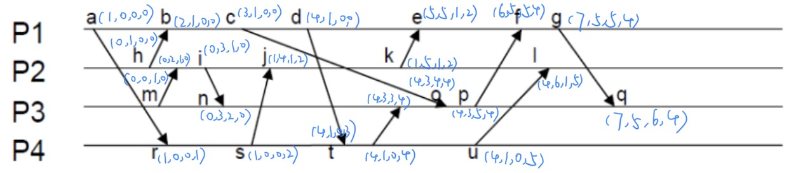

<h1 align=center>分布式系统第四次作业</h1>

<h1 align=center>何泽    18340052</h1>

## Ⅰ

> 当某个节点要使其时钟与另一个节点的时钟同步时，通常， 一个较好的想法是还要把以前的度量(偏差)考虑进去。为什么?请给出这样的一个示例。

将以前的度量考虑进去是因为当前可能出现错误。如果时钟只需要逐步调整，那么可以考虑最后的N，然后计算平均值或找到中位数，如果测量值超过当前时间间隔则不考虑。同样，一个新的值也可以通过计算加权平均值得到。

## Ⅱ

> Ricart和Agrawala算法会有这样的问题:如果一个进程崩溃， 并且没有对另一个请求访问资源的进程的请求作回答，没有应答意味着拒绝请求。建议所有的请求应当立即被应答，以便容易地检测到崩溃的进程。是否存在一些情况，即使使用这种方法也还不够？请讨论。

如果一个进程拒绝了请求然后同时崩溃，那么此时请求的进程会认为此进程是活动的，但是许可并不会到来。解决方法可以是请求者并不阻塞，而是在一段时间内休眠，之后测试之前拒绝许可的进程是否还在活动没有崩溃。

## Ⅲ

> 请标出下图中各个事件的逻辑时钟和向量时钟
>
> 

