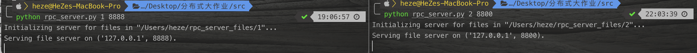
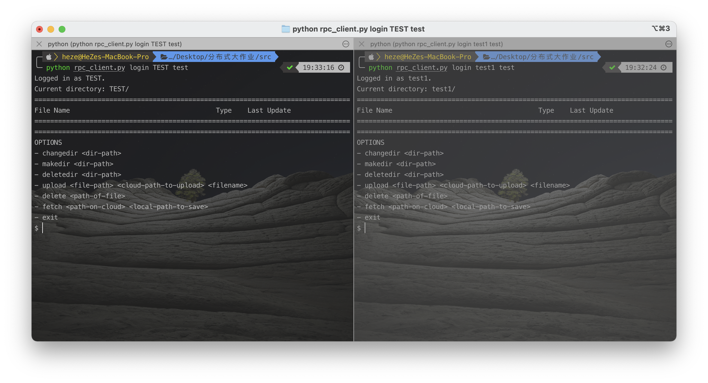
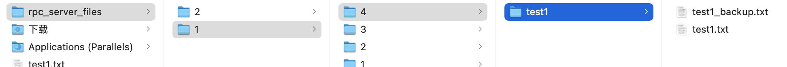

<h1 align=center>分布式系统大作业——分布式文件系统</h1>

|   姓名   |             何泽             |
| :------: | :--------------------------: |
| **班级** | 计算机科学与技术（超算方向） |
| **学号** |           18340052           |
| **日期** |        2021年1月26日         |

[TOC]

## 一、题目要求

> 设计一个分布式文件系统。该文件系统可以是client-server架构，也可以是P2P非集中式架构。 要求文件系统具有基本的访问、打开、删除、缓存等功能，同时具有一致性、支持多用户特点。 在设计过程中能够体现在分布式课程中学习到的一些机制或者思想，例如Paxos共识、缓存更新机制、访问控制机制、并行扩展等。
>
> 要求：
>
> - 编程语言不限，选择自己熟悉的语言，但是推荐用Python或者Java语言实现；
> - 文件系统中不同节点之间的通信方式采用RPC模式，可选择Python版本的RPC、gRPC等；
> - 文件系统具备基本的文件操作模型包括：创建、删除、访问等功能；
> - 作为文件系统的客户端要求具有缓存功能即文件信息首先在本地存储搜索，作为缓存的介质可以是内存也可以是磁盘文件；
> - 为了保证数据的可用性和文件系统性能，数据需要创建多个副本，且在正常情况下，多个副本不在同一物理机器，多个副本之间能够保持一致性（可选择最终一致性即延迟一致性也可以选择瞬时一致性即同时写）；
> - 支持多用户即多个客户端，文件可以并行读写（即包含文件锁）；
> - 对于上述基本功能，可以在本地测试，利用多个进程模拟不同的节点，需要有相应的测试命令或者测试用例，并有截屏或者video支持；
> - 提交源码和报告，压缩后命名方式为：学号\_姓名_班级
> - 实验报告长度不超过20页；
>
> 加分项：
>
> - 加入其它高级功能如缓存更新算法；
> - Paxos共识方法或者主副本选择算法等；
> - 访问权限控制；
> - 其他高级功能；

## 二、解决思路

我的解决思路为通过两个服务器——`name_server`和`rpc_server`，和一个客户端`rpc_client`来实现一个**基于RPC的可以多用户登录的具有安全性和容错性并有冗余的分布式文件系统**。

### 1. name_server

name_server的作用是确保client和server之间可以正常通信，它的功能可以由客户机和服务器通过RPC调用。它保存一个数据库，用于在单独的表中存储用户、文件和服务器数据，它还可以更改这些表并在被请求时提供数据，比如删除并保存到数据库、获取用户凭证和服务器地址。它是用Python的`xmlrpc`模块的`SimpleXMLRPCServer`类实现的。

### 2. rpc_server

服务器存储用户上传的文件，为了保证冗余，每个服务器都有一个存储相同文件的备份服务器。服务器有两种类型的目录，一种由拥有该目录的用户命名，另一种由用户命名并标记为backup ('_backup')。上传文件时，它的散列存储在数据库中，当获取文件时，它的哈希值将被重新计算，并与数据库中记录的哈希值进行比较，如果不匹配，则检查备份服务器中的副本并将其发送到客户端。服务器实现了获取所有者和备份信息、哈希文件、获取文件名、创建和删除目录以及上传、删除和发送文件的方法，其中一些函数由client调用以执行列出的操作，其他函数在内部使用。

### 3. rpc_client

客户端实现与用户直接交互的系统部分，它连接到name server，以连接到承载用户文件的服务器。它有两种模式:注册和登录。在注册模式下，它向名称服务器发出注册用户的请求。名称服务器检查用户名是否唯一，如果没有问题就注册用户。在登录模式下，客户端向用户显示多个选项，如如何使用中所说明的。上传和下载文件时，在客户端对文件进行加密和解密，只有加密的二进制文件保存在服务器上。

### 4. 安全性与容错性

为了确保安全性，使用特定于用户的salt对密码进行散列，并使用散列密码对文件进行加密。用户可以在他们的目录中导航，但是当他们到达以他们的用户id命名的目录时却不能移动。当用户想要更新一个文件时，旧版本会被新版本替换，并重新计算它的哈希值。最近的散列保存在name server的数据库中，当用户想要获取文件时，将此散列与请求时计算的散列进行比较。当哈希值不匹配时，服务器连接到备份服务器以检查备份文件的哈希值，bcrypt和cryptography分别用于散列密码和文件二进制。

## 三、实现细节

所实现的功能：

- 使用RPC在不同节点间通信
- 文件可以创建、删除、切换目录、新建与删除目录、上传文件、下载文件
- 文件有冗余，符合瞬时一致性
- 可以多用户登录，每个用户有有户名和密码
- 有安全性和容错性，可以对文件和密码加密

结构图：


### 1. name_server

- 数据库格式：
    - 用户

        | USERID  | USERNAME | PASSWORD | SALT |
        | :-----: | :------: | :------: | :--: |
        | integer |   text   |   text   | text |
    - 文件

        | FILEID  | USERID  | SERVERID |  PATH   | FILENAME | ISBACKUP | FILEHASH | LASTMODIFIED | USERID  | SERVERID |
        | :-----: | :-----: | :------: | :-----: | :------: | :------: | :------: | :----------: | :-----: | :------: |
        | integer | integer | integer  | integer |   text   | integer  |   text   |   integer    | integer | integer  |
    - 服务器

        | SERVERID | ADDRESS |
        | :------: | :-----: |
        | integer  |  text   |

- 存储、查询用户信息

    ```python
    def save_user(username, hash_password, salt):
        try:
            cursor.execute('INSERT INTO USERS (USERNAME, PASSWORD, SALT) VALUES (?, ?, ?);',
                           (username, str(base64.b64decode(hash_password), 'utf-8'), str(base64.b64decode(salt), 'utf-8')))
            connection.commit()
            return True
        except sqlite3.Error:
            return False
    
    
    def get_user_credentials(username):
        try:
            cursor.execute('SELECT USERID, PASSWORD, SALT FROM USERS WHERE USERNAME = ?;', (username, ))
            results = cursor.fetchone()
            return results
        except sqlite3.Error:
            return None
    ```

- 存储、查询文件信息

    ```python
    def save_file_info(file_list):
        try:
            cursor.executemany('''INSERT INTO FILES (USERID, SERVERID, PATH, FILENAME, ISBACKUP, FILEHASH, LASTMODIFIED) 
                                  VALUES (?, ?, ?, ?, ?, ?, ?)''', file_list)
            connection.commit()
    
            return True
        except sqlite3.Error:
            return False
    
    
    def get_file_infos(user_id, cloud_dir_paths):
        try:
            all_results = []
    
            for dir_path in cloud_dir_paths:
                cursor.execute('''SELECT FILENAME, LASTMODIFIED FROM FILES 
                                    WHERE ISBACKUP = 0 AND USERID = ? AND PATH LIKE ?;''', (user_id, dir_path + '%'))
                all_results += cursor.fetchall()
    
            return all_results
        except sqlite3.Error:
            return []
    ```

- 获取文件备份

    ```python
    def get_file_backup_servers(server_id, user_id, cloud_file_rel_path):
        try:
            cursor.execute('''SELECT ADDRESS FROM FILES JOIN SERVERS USING (SERVERID) 
                                WHERE ISBACKUP = 1 AND SERVERID != ? AND USERID = ? AND PATH = ?''',
                           (server_id, user_id, cloud_file_rel_path))
            results = cursor.fetchall()
    
            return [address for (address, ) in results]
        except sqlite3.Error:
            return []
    ```

- 删除文件

    ```python
    def remove_file(user_id, cloud_file_rel_path):
        try:
            cursor.execute('DELETE FROM FILES WHERE USERID = ? AND PATH = ?;', (user_id, cloud_file_rel_path))
            connection.commit()
    
            return True
        except sqlite3.Error:
            return False
    ```

- 获取文件哈希值

    ```python
    def get_file_hashes(user_id, cloud_file_rel_path):
        try:
            cursor.execute('''SELECT ISBACKUP, FILEHASH, ADDRESS FROM FILES JOIN SERVERS USING (SERVERID) 
                                WHERE USERID = ? AND PATH = ? ORDER BY ISBACKUP DESC;''', (user_id, cloud_file_rel_path))
            results = cursor.fetchall()
    
            return [(file_hash, address) for _, file_hash, address in results]
        except sqlite3.Error:
            return []
    ```

- 主函数

    ```python
    server_counter = 0
    connection = sqlite3.connect('info.db')
    cursor = connection.cursor()
    init_db()
    
    with SimpleXMLRPCServer(name_server_info, allow_none=True) as server:
        server.register_function(get_next_server)
        server.register_function(save_user)
        server.register_function(get_user_credentials)
        server.register_function(get_server_addresses)
        server.register_function(register_file_server)
        server.register_function(unregister_file_server)
        server.register_function(save_file_info)
        server.register_function(get_file_infos)
        server.register_function(get_file_backup_servers)
        server.register_function(remove_file)
        server.register_function(get_file_hashes)
        try:
            server.serve_forever()
            except KeyboardInterrupt:
                connection.close()
    ```

### 2. rpc_server

- 获取一个文件所属用户以及备份状态

    ```python
    def get_owner_and_backup_info(rel_path_obj):
        folder = rel_path_obj.parts[0]
        try:
            if folder.endswith('_backup'):
                return int(folder.replace('_backup', '')), 1
            else:
                return int(folder), 0
        except ValueError:
            return -1, 0
    ```

- 生成文件信息

    ```python
    def generate_file_info(server_id, os_file_path, os_file_name):
        file_last_modified = os.path.getmtime(os_file_path)
        file_hash = hash_file(os_file_path)
        file_path_rel = Path(os_file_path).relative_to(root_dir)
        whose, is_backup = get_owner_and_backup_info(file_path_rel)
        file_path_str = str(file_path_rel.relative_to(file_path_rel.parts[0]))
        return whose, server_id, file_path_str, os_file_name, is_backup, file_hash, file_last_modified
    ```

- 创建一个新目录

    ```python
    def make_dirs(user_id, cloud_dir_path):
        base_dir = root_dir / str(user_id)
        path_valid, path_exists, rel_path_str = path_check(user_id, cloud_dir_path)
        path_obj = base_dir / rel_path_str
        if not path_valid or path_exists:
            return False
        path_obj.mkdir(parents=True)
        return True
    ```

- 删除文件，根据是否被备份分为两种情况

    ```python
    def delete_file(user_id, cloud_file_path, backup=False):
        global args
        path_valid, path_exists, rel_path_str = path_check(user_id, cloud_file_path, backup=backup)
        if not path_valid or not path_exists:
            return False
        
        if backup:
            path_obj = (root_dir / (str(user_id) + '_backup') / rel_path_str).resolve()
        else:
            path_obj = (root_dir / str(user_id) / rel_path_str).resolve()
        if path_obj.is_file():
            os.remove(str(path_obj))
        else:
            return False
    
        if not backup:
            with ServerProxy(name_server_url, allow_none=True) as name_proxy:
                addresses = name_proxy.get_file_backup_servers(args.server_id, user_id, rel_path_str)
            for address in addresses:
                with ServerProxy(address, allow_none=True) as file_server_proxy:
                    if not file_server_proxy.delete_file(user_id, cloud_file_path, True):
                        return False
            with ServerProxy(name_server_url, allow_none=True) as name_proxy:
                if not name_proxy.remove_file(user_id, rel_path_str):
                    return False
        return True
    ```

- 本地上传文件到服务器，并备份

    ```python
    def upload_file(user_id, file_bin, cloud_dir_path, filename, backup=False):
        global args
        path_valid, path_exists, rel_path_str = path_check(user_id, cloud_dir_path)
        if not path_valid:
            return False
        if backup:
            path_obj = (root_dir / (str(user_id) + '_backup') / rel_path_str).resolve()
            if not path_obj.exists():
                path_obj.mkdir(parents=True)
            path_obj = (path_obj / filename).resolve()
        else:
            if not path_exists:
                return False
            path_obj = (root_dir / str(user_id) / rel_path_str / filename).resolve()
        with open(str(path_obj), 'wb') as handle:
            handle.write(file_bin.data)
    
        if not backup:
            with ServerProxy(name_server_url, allow_none=True) as name_proxy:
                address = name_proxy.get_next_server()
            if address == '':
                return False
            with ServerProxy(address, allow_none=True) as file_server_proxy:
                if not file_server_proxy.upload_file(user_id, file_bin, cloud_dir_path, filename, True):
                    return False
        with ServerProxy(name_server_url, allow_none=True) as name_proxy:
            saved = name_proxy.save_file_info([generate_file_info(args.server_id, str(path_obj), filename)])
        return saved
    ```

- 从服务器下载文件到本地

    ```python
    def fetch_file(user_id, cloud_file_path, backup=False, backup_ord=0):
        path_valid, path_exists, rel_path_str = path_check(user_id, cloud_file_path)
        if not path_valid or not path_exists:
            return False, None
        if backup:
            path_obj = (root_dir / (str(user_id) + '_backup') / rel_path_str).resolve()
        else:
            path_obj = (root_dir / str(user_id) / rel_path_str).resolve()
        if not path_obj.is_file():
            return False, None
        with ServerProxy(name_server_url, allow_none=True) as name_proxy:
            hash_info = name_proxy.get_file_hashes(user_id, rel_path_str)
        own_hash_matches, code = check_file_hash(user_id, cloud_file_path, hash_info[backup_ord][0])
        if own_hash_matches:
            return True, get_file_binary(str(path_obj))
        else:
            for i in range(1, len(hash_info)):
                file_hash, address = hash_info[i]
                with ServerProxy(address, allow_none=True) as file_server_proxy:
                    success, binary = file_server_proxy.fetch_file(user_id, cloud_file_path, True, i)
    
                    if success:
                        return True, binary
            return False, None
    ```

### 3. rpc_client

- 注册

    ```python
    def sign_up(username, password):
        if len(password) > 72:
            print('Password must be less than 72 characters.')
            return
        salt = bcrypt.gensalt()
        hash_password = bcrypt.hashpw(bytes(password, 'utf-8'), salt)
        print(salt, hash_password)
        if proxy.save_user(username, str(base64.b64encode(hash_password), 'utf-8'), str(base64.b64encode(salt), 'utf-8')):
            print('User {} created successfully.'.format(username))
        else:
    ```

- 登录

    ```python
    def login(username, password):
        results = proxy.get_user_credentials(username)
        if results is None:
            print('Username does not exist.')
        else:
            user_id = int(results[0])
            hash_password = bytes(results[1], 'utf-8')
            if bcrypt.checkpw(bytes(password, 'utf-8'), hash_password):
                print('Logged in as {}.'.format(username))
                return App(user_id, username)
            else:
                print('Wrong password.')
        return None
    ```

- 显示所有文件，包括文件名、类型以及最后一次更新的时间

    ```python
    def list_file_names(user_id, cloud_file_path):
        addresses = proxy.get_server_addresses(user_id)
        dir_paths = set()
        info_queries = set()
        print('=' * 80)
        print('{0:45s} {1:7s} {2}'.format('File Name', 'Type', 'Last Update'))
        print('=' * 80)
        for address in addresses:
            with ServerProxy(address, allow_none=True) as new_proxy:
                for is_dir, file_path in new_proxy.get_filenames(user_id, cloud_file_path):
                    if is_dir:
                        dir_paths.add(file_path)
                    else:
                        info_queries.add(file_path)
        for dir_path in dir_paths:
            print('{0:45s} <DIR>'.format(Path(dir_path).name + '/'))
        for file_name, mod_date in proxy.get_file_infos(user_id, list(info_queries)):
            print('{0:45s} {1:7s} {2}'.format(file_name, Path(file_name).suffix[1:].upper(),
                                              datetime.datetime.fromtimestamp(mod_date)))
        print('=' * 80)
    ```

- 创建目录

    ```python
    def make_dirs(user_id, cloud_dir_path):
        addresses = proxy.get_server_addresses(user_id)
        exists = False
        for address in addresses:
            with ServerProxy(address, allow_none=True) as new_proxy:
                path_valid, path_exists, rel_path_str = new_proxy.path_check(user_id, cloud_dir_path)
                if path_valid and path_exists:
                    exists = True
        if exists:
            return False
        address = proxy.get_next_server()
        with ServerProxy(address, allow_none=True) as new_proxy:
            made = new_proxy.make_dirs(user_id, cloud_dir_path)
        return made
    ```

- 删除文件

    ```python
    def delete_file(user_id, cloud_file_path):
        addresses = proxy.get_server_addresses(user_id)
        existing_servers = []
        for address in addresses:
            with ServerProxy(address, allow_none=True) as new_proxy:
                path_valid, path_exists, rel_path_str = new_proxy.path_check(user_id, cloud_file_path)
                if path_valid and path_exists:
                    existing_servers.append(address)
        if len(existing_servers) != 1:
            return False
        with ServerProxy(existing_servers[0], allow_none=True) as new_proxy:
            success = new_proxy.delete_file(user_id, cloud_file_path)
        return success
    ```

- 上传文件

    ```python
    def upload_file(user_id, file_bin, cloud_file_path, filename):
        addresses = proxy.get_server_addresses(user_id)
        file_path_with_filename = str(Path(cloud_file_path) / filename)
        existing_servers = []
        for address in addresses:
            with ServerProxy(address, allow_none=True) as new_proxy:
                path_valid, path_exists, rel_path_str = new_proxy.path_check(user_id, file_path_with_filename)
                if path_valid and path_exists:
                    existing_servers.append(address)
        if len(existing_servers) > 1:
            return False
        elif len(existing_servers) == 1:
            deleted = delete_file(user_id, file_path_with_filename)
            if not deleted:
                return False
        address = proxy.get_next_server()
        with ServerProxy(address, allow_none=True) as new_proxy:
            added = new_proxy.upload_file(user_id, file_bin, cloud_file_path, filename)
        return added
    ```

- 下载文件

    ```python
    def fetch_file(user_id, username, cloud_file_path, local_path_obj):
        addresses = proxy.get_server_addresses(user_id)
        flag = False
        file_bin = None
        for address in addresses:
            with ServerProxy(address, allow_none=True) as new_proxy:
                path_valid, path_exists, rel_path_str = new_proxy.path_check(user_id, cloud_file_path)
                if path_valid and path_exists:
                    flag, file_bin = new_proxy.fetch_file(user_id, cloud_file_path)
        filename = Path(cloud_file_path).name
        if not flag:
            return False
        with open(str((local_path_obj / filename).resolve()), 'wb') as handle:
            decrypted = decrypt_file(username, file_bin)
            try:
                handle.write(decrypted)
            except IOError:
                return False
        return True
    ```

- 对文件加密与解密

    ```python
    def decrypt_file(username, file_bin):
        _, password, salt = proxy.get_user_credentials(username)
        kdf = PBKDF2HMAC(
            algorithm=hashes.SHA256(),
            length=32,
            salt=bytes(salt, 'utf-8'),
            iterations=100000,
            backend=default_backend()
        )
        pass_as_bytes = bytes(password, 'utf-8')
        key = base64.urlsafe_b64encode(kdf.derive(pass_as_bytes))
        f = Fernet(key)
        decrypted = Binary(f.decrypt(file_bin.data))
        return decrypted.data
    
    
    def encrypt_file(username, file_bin):
        _, password, salt = proxy.get_user_credentials(username)
        kdf = PBKDF2HMAC(
            algorithm=hashes.SHA256(),
            length=32,
            salt=bytes(salt, 'utf-8'),
            iterations=100000,
            backend=default_backend()
        )
        pass_as_bytes = bytes(password, 'utf-8')
        key = base64.urlsafe_b64encode(kdf.derive(pass_as_bytes))
        f = Fernet(key)
        encrypted = f.encrypt(file_bin.data)
        return encrypted
    ```


以上是对主要代码部分的解释。

## 四、结果展示

### 1. 使用方法

- 首先需要python3

- 通过pip安装bcrypt

    ```shell
    python -m pip install bcrypt
    ```

- 启动name_server

    ```shell
    python name_server
    ```

- 启动rpc_server，并在参数中说明服务器ID以及端口号

    ```shell
    python rpc_server.py <server_id> <port>
    ```

    比如如下命令：

    ```shell
    python rpc_server 1 8888
    ```

- 启动rpc_client，先注册，再登录

    - 注册：

        ```shell
        python rpc_client.py signup <username> <password>
        ```

    - 登录：

        ```shel
        python rpc_client.py login <username> <password>
        ```

- 登录后，可使用如下命令：
    - 改变目录: `changedir <directory-path>`
    - 创建目录: `makedir <directory-path>`
    - 删除目录: `deletedir <directory-path>`
    - 上传文件: `upload <file-path> <cloud-path-to-upload> <filename>`
    - 删除文件: `delete <path_of_file>`
    - 下载文件: `fetch <file-path> <cloud-path-to-upload> <filename>`
    - 退出: `exit`

### 2. 运行截图

- 启动name_server，每当有操作进行便会显示

    

- 启动rpc_server

    

- 用户注册，可显示加密后的数据：

    

- 使用刚刚注册的用户名密码登录

    

    登录后便可显示当前目录下的文件信息和操作提示

- 可以同时开启多个服务器，只要ID和端口号不同即可：

    

- 多个客户端：

    

    并且多个客户端可以并行读写。

- 创建几个服务器、目录并上传几个文件后服务器的存储文件格式如下：

    

    第二列的1、2代表服务器ID，第三列的数字代表不同用户的用户ID，第四列代表该用户创建的目录，之后便是上传的文件及备份。

    并且上传文件后各个客户端都可以看到，完成实验要求。

## 五、遇到的问题

此次实验遇到的主要问题是完成RPC的实现方式，我选择的是Python的`xmlrpc`模块的`SimpleXMLRPCServer`类，这个相对来讲使用会比较方便，我也花了很多时间来了解使用方法，当看懂了之后就没有什么大问题了，只是一些小的bug，总体上只要了解了RPC的实现，只要按照老师上课讲的一些概念和思路完成就行了。

## 六、总结

这次大作业完成了分布式文件系统，不仅让我对RPC有了更加深刻的认识，也让我对一致性有了更全面的理解，之前在课堂上只是听了理论介绍，然后在上学期也实现了非分布式的文件系统，这次自己实现了分布式的文件系统后也更加理解了分布式系统这门课程的精髓，对分布式也有了更多的认识。